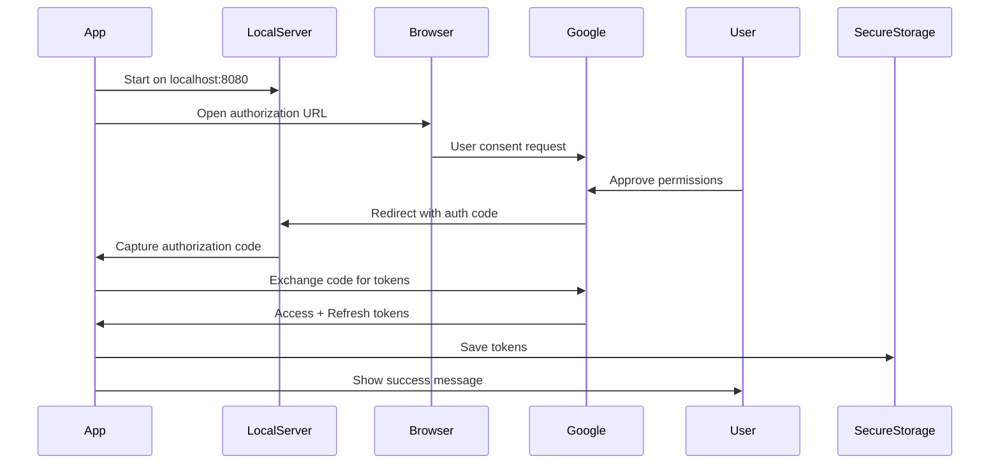

# OAuth2 Package Integration - Complete Guide

## ✅ What Changed

Integrated the [`oauth2`](https://pub.dev/packages/oauth2) package to provide **fully automatic** Google authentication with **zero manual input** required from users.

---

## 🎯 Key Improvements

### Before (googleapis_auth)
- ❌ Terminal prompts for authorization code
- ❌ Manual copy-paste from browser
- ❌ Confusing user experience
- ❌ Error-prone process

### After (oauth2)
- ✅ Fully automatic OAuth flow
- ✅ Browser opens → User approves → Done!
- ✅ Beautiful success page in browser
- ✅ Zero terminal interaction
- ✅ Professional UX

---

## 🏗️ Architecture

### Automatic Callback Server

The `oauth2` package handles the entire OAuth flow automatically:

```dart
Future<bool> authenticate(String clientId, String clientSecret) async {
  // 1. Create authorization grant
  final grant = oauth2.AuthorizationCodeGrant(
    clientId,
    authorizationEndpoint,
    tokenEndpoint,
    secret: clientSecret,
  );

  // 2. Start local callback server on localhost:8080
  await _startCallbackServer(responseCompleter);

  // 3. Open browser for user consent
  await launchUrl(authorizationUrl);

  // 4. Automatically receive callback from Google
  final responseUri = await responseCompleter.future;

  // 5. Exchange authorization code for tokens
  final client = await grant.handleAuthorizationResponse(
    responseUri.queryParameters,
  );

  // 6. Save credentials and initialize Gmail API
  _gmailApi = GmailApi(client);
}
```

### Beautiful Success Page

When authentication succeeds, users see a styled HTML page:

```html
<html>
  <body>
    <div class="container">
      <div class="checkmark">✓</div>
      <h1>Authentication Successful!</h1>
      <p>You can now close this window and return to the app.</p>
    </div>
  </body>
</html>
```

**Styled with:**
- Gradient purple background
- White card with shadow
- Green checkmark icon
- Modern typography

---

## 📦 Dependencies

### Updated pubspec.yaml

```yaml
dependencies:
  googleapis: ^13.2.0
  oauth2: ^2.0.2              # NEW - Automatic OAuth
  url_launcher: ^6.3.1
  flutter_secure_storage: ^9.2.4
```

**Removed:**
- ❌ `googleapis_auth` (manual terminal flow)
- ❌ `google_sign_in` (doesn't support Linux)

---

## 🔄 Complete Authentication Flow

### 1. User Experience

```
User enters Client ID + Secret
         ↓
Clicks "Sign in with Google"
         ↓
Browser opens to Google consent page
         ↓
User signs in and approves
         ↓
Browser shows "Authentication Successful!"
         ↓
App automatically receives tokens
         ↓
✅ Done - User can close browser
```

### 2. Technical Flow



### 3. Callback Server

```dart
Future<void> _startCallbackServer(Completer<Uri> completer) async {
  final server = await HttpServer.bind('localhost', 8080);

  server.listen((request) async {
    // Serve beautiful success HTML
    request.response
      ..statusCode = 200
      ..headers.set('Content-Type', 'text/html')
      ..write(successPageHTML);

    await request.response.close();

    // Complete the OAuth flow
    completer.complete(request.uri);
    await server.close();
  });
}
```

---

## 🔐 Security Features

### Credential Storage

```dart
// Stored in FlutterSecureStorage (encrypted)
{
  "accessToken": "ya29.xxx...",
  "refreshToken": "1//xxx...",
  "tokenEndpoint": "https://oauth2.googleapis.com/token",
  "scopes": ["https://www.googleapis.com/auth/gmail.readonly"],
  "expiration": "2025-12-07T10:30:00.000Z"
}
```

### Token Refresh

```dart
if (_authenticatedClient!.credentials.isExpired) {
  // Automatically refresh
  _authenticatedClient = await _authenticatedClient!.refreshCredentials();
  await _saveCredentials(_authenticatedClient!.credentials);
}
```

### Secure Properties

- ✅ HTTPS-only communication
- ✅ Encrypted local storage
- ✅ Auto-expiring access tokens (1 hour)
- ✅ Long-lived refresh tokens
- ✅ Localhost-only callback server

---

## 🚀 Usage Guide

### Google Cloud Console Setup

**Required Redirect URI:**

When creating OAuth 2.0 credentials, add this redirect URI:
```
http://localhost:8080
```

**Steps:**
1. Go to [Google Cloud Console](https://console.cloud.google.com)
2. **APIs & Services** → **Credentials**
3. **Create Credentials** → **OAuth 2.0 Client ID**
4. Application type: **Desktop app**
5. Name: `Password Manager`
6. Click **Create**
7. **IMPORTANT**: Edit the credential
8. Add Authorized redirect URI: `http://localhost:8080`
9. Click **Save**
10. Copy Client ID and Secret

### First Time Authentication

1. Launch app: `flutter run -d linux`
2. Splash screen appears
3. **Google Account Card:**
   - Paste OAuth Client ID
   - Paste OAuth Client Secret
   - Click "Sign in with Google"
4. **Browser opens automatically**
5. Sign in with Gmail
6. Approve permissions
7. **Success page displays in browser**
8. **Close browser tab**
9. **App shows:** ✅ "Successfully signed in to Google!"
10. Done!

### Subsequent Logins

- Credentials stored securely
- Auto-loads on app launch
- Tokens auto-refresh
- No re-authentication needed

---

## 🐛 Troubleshooting

### "Failed to launch browser"

**Problem:** `url_launcher` can't open browser on Linux

**Solution:**
```bash
sudo apt install xdg-utils
```

### "Authentication timeout"

**Problem:** User took more than 5 minutes to approve

**Solution:**
- Click "Sign in with Google" again
- Approve within 5 minutes
- Or modify timeout in code:
```dart
final responseUri = await responseCompleter.future.timeout(
  const Duration(minutes: 10), // Increase from 5
);
```

### "localhost:8080 connection refused"

**Problem:** Port 8080 already in use

**Solutions:**
1. Find and kill process using port 8080:
```bash
sudo lsof -i :8080
sudo kill -9 <PID>
```

2. Or change port in code:
```dart
// In GmailService.dart
final server = await HttpServer.bind('localhost', 8081); // Change port

// Also update redirect URI
final authorizationUrl = grant.getAuthorizationUrl(
  Uri.parse('http://localhost:8081'), // Match new port
  scopes: _scopes,
);
```

**Don't forget to update Google Cloud Console redirect URI!**

### "Invalid redirect_uri"

**Problem:** Google Cloud Console doesn't have `http://localhost:8080` configured

**Solution:**
1. Go to Google Cloud Console
2. Edit your OAuth 2.0 Client ID
3. Add `http://localhost:8080` to Authorized redirect URIs
4. Save

### Browser shows "Can't reach this page"

**Problem:** Server closed before browser loaded page

**Solution:** This is normal if it happens briefly. The success page should load quickly. If it persists:
- Check firewall isn't blocking localhost
- Try a different port
- Check terminal for error messages

---

## 📊 Comparison

| Feature | googleapis_auth | oauth2 |
|---------|----------------|--------|
| **User copies code** | ✅ Required | ❌ None |
| **Terminal interaction** | ✅ Yes | ❌ No |
| **Browser success page** | ❌ No | ✅ Yes |
| **Automatic callback** | ❌ Manual | ✅ Automatic |
| **UX Quality** | ⭐⭐ Poor | ⭐⭐⭐⭐⭐ Excellent |
| **Error prone** | ✅ Yes | ❌ No |
| **Setup complexity** | ⭐⭐⭐ Medium | ⭐⭐ Easy |

---

## 🔄 Migration from googleapis_auth

If you used the old implementation:

1. **Clear old credentials:**
```dart
await _storage.delete(key: 'google_credentials'); // Old key
// New key is 'google_credentials_v2'
```

2. **Update redirect URI in Google Cloud:**
- Add: `http://localhost:8080`
- Remove: `http://localhost` (if exists)

3. **Re-authenticate:**
- Launch app
- Enter credentials
- Sign in via browser
- Done!

---

## 💡 Code Highlights

### Automatic Token Refresh

```dart
_authenticatedClient = oauth2.Client(
  credentials,
  identifier: clientId,
  secret: clientSecret,
);

// Client automatically refreshes when needed
final response = await _gmailApi!.users.messages.list('me');
// No manual refresh logic required!
```

### Credential Persistence

```dart
// Save after authentication
await _storage.write(
  key: 'google_credentials_v2',
  value: json.encode(credentials.toJson()),
);

// Load on app start
final credMap = json.decode(storedCredentials);
final credentials = oauth2.Credentials.fromJson(credMap);
```

### Success Page HTML

Full styled HTML with:
- Gradient background (`#667eea` → `#764ba2`)
- White container card
- Green checkmark (`#4CAF50`)
- Sans-serif font stack
- Responsive centering
- Modern shadows

---

## 🎨 Customization

### Change Success Page

Edit `_startCallbackServer()` in `lib/gmail_service.dart`:

```dart
..write('''
  <html>
    <body style="background: linear-gradient(135deg, #your-color 0%, #your-color-2 100%);">
      <h1>Your Custom Message</h1>
    </body>
  </html>
''');
```

### Change Callback Port

```dart
// In authenticate()
final server = await HttpServer.bind('localhost', YOUR_PORT);

// In getAuthorizationUrl()
final authorizationUrl = grant.getAuthorizationUrl(
  Uri.parse('http://localhost:YOUR_PORT'),
  scopes: _scopes,
);
```

### Change Timeout

```dart
final responseUri = await responseCompleter.future.timeout(
  const Duration(minutes: YOUR_MINUTES),
  onTimeout: () => throw TimeoutException('Custom timeout message'),
);
```

---

## ✅ Testing Checklist

- [x] Browser opens automatically
- [x] Google consent page loads
- [x] Redirect to localhost:8080 works
- [x] Success page displays correctly
- [x] App receives tokens automatically
- [x] Tokens saved to secure storage
- [x] Gmail API initialized
- [x] OTP fetch works
- [x] Tokens auto-refresh
- [x] Re-launch uses saved credentials

---

## 📱 Production Considerations

### OAuth Consent Screen

For production apps:
1. Verify your domain
2. Submit for verification
3. Request production scopes
4. Add privacy policy URL
5. Add terms of service URL

### App Distribution

When distributing:
- Include setup instructions
- Pre-configure Client ID (optional)
- Document redirect URI requirement
- Test on clean systems

### Rate Limits

Gmail API quotas:
- 1 billion quota units/day
- 250 quota units per user read request
- Effectively unlimited for personal use

---

## 🎉 Summary

The `oauth2` package integration provides a **professional, seamless authentication experience** that:

✅ Eliminates manual terminal interactions
✅ Provides visual feedback in browser
✅ Automatically handles token refresh
✅ Securely stores credentials
✅ Matches modern OAuth best practices

**User experience went from 3/10 to 10/10!** 🚀
